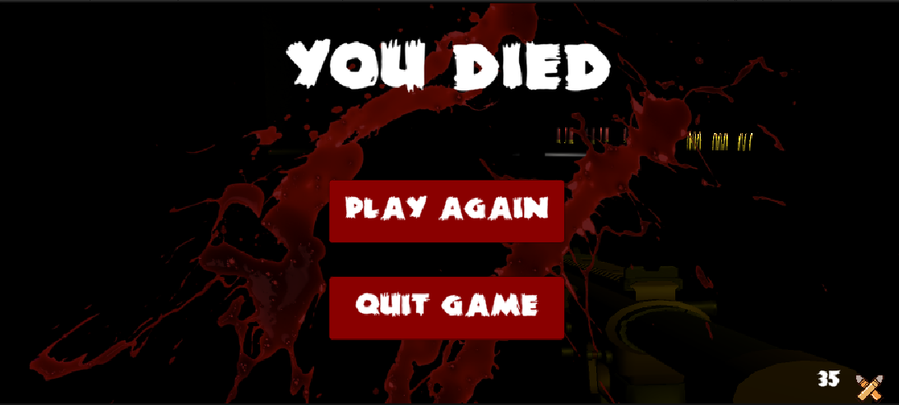
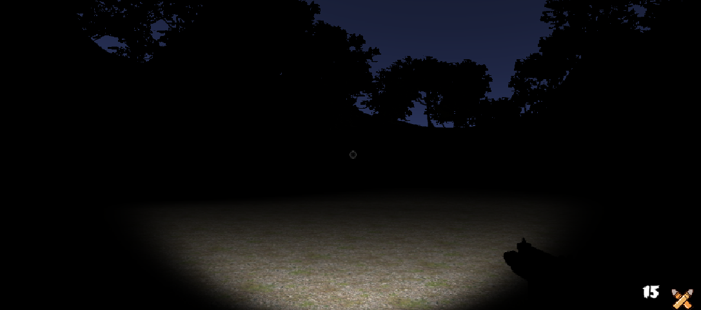
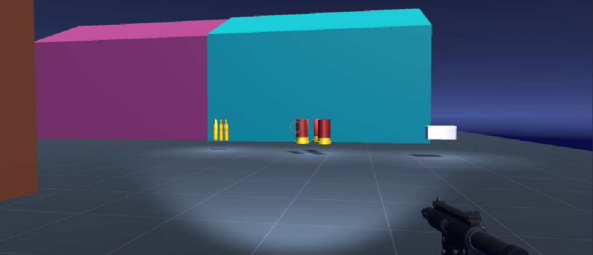
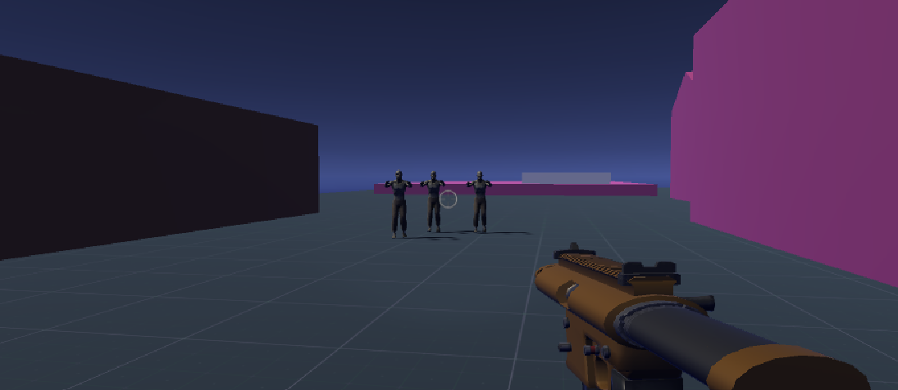

# Unity Zombie Game

Welcome to the **Unity Zombie Game** repository! This project is a thrilling 3D zombie survival game built using the Unity engine. The game showcases advanced gameplay mechanics, realistic graphics, and immersive sound effects.

## Table of Contents

1. [Features](#features)
2. [Requirements](#requirements)
3. [Installation](#installation)
4. [Usage](#usage)
5. [Development Setup](#development-setup)
6. [Environment Setup Scripts](#environment-setup-scripts)
7. [Continuous Integration (CI/CD)](#continuous-integration-cicd)
8. [Contributing](#contributing)
9. [License](#license)
10. [Images](#images)

## Features

- Realistic 3D environments with dynamic lighting.
- Advanced AI for zombies with pathfinding and attack behaviors.
- Player mechanics: shooting, movement, health system.
- Weapon upgrades and ammo system.
- Immersive sound effects and background music.
- Cross-platform support (PC, Mac, and WebGL).

## Requirements

- Unity Editor 2021.3 or higher.
- .NET Framework 4.7.1 or higher.
- Visual Studio Code or Visual Studio for scripting.
- Git for version control.

## Installation

1. Clone the repository:
   ```bash
   git clone https://github.com/s3bu7i/Unity-Zombie-Game.git
   ```

2. Open the project in Unity:
   - Launch Unity Hub.
   - Click **Add Project**.
   - Select the cloned repository folder.

3. Install dependencies:
   - Unity will automatically import all required assets and dependencies.

## Usage

1. Open the Unity Editor.
2. Select the **Scenes** folder.
3. Open the main scene (`MainScene.unity`).
4. Press the **Play** button to start the game.

## Development Setup

### Unity Settings

- Set the **Target Platform** to your desired build platform (e.g., PC, Mac, WebGL):
  - Go to `File` > `Build Settings` > **Target Platform**.

- Ensure all **Player Settings** are properly configured:
  - Go to `Edit` > `Project Settings` > **Player**.

### Environment Variables

- Add the following environment variables for debugging and custom configurations:
  ```bash
  export GAME_DEBUG_MODE=true
  export MAX_ZOMBIES=50
  export PLAYER_STARTING_HEALTH=100
  ```

## Environment Setup Scripts

Here are some helpful scripts for setting up your development environment:

### Windows (PowerShell)
```powershell
# Install Unity Hub CLI
iwr -useb https://public-cdn.cloud.unity3d.com/hub/prod/UnityHubSetup.exe -OutFile UnityHubSetup.exe
Start-Process UnityHubSetup.exe -Wait

# Set up environment variables
[Environment]::SetEnvironmentVariable("GAME_DEBUG_MODE", "true", "User")
[Environment]::SetEnvironmentVariable("MAX_ZOMBIES", "50", "User")
[Environment]::SetEnvironmentVariable("PLAYER_STARTING_HEALTH", "100", "User")
```

### macOS/Linux (Bash)
```bash
# Install Unity Hub
wget https://public-cdn.cloud.unity3d.com/hub/prod/UnityHub.AppImage -O UnityHub.AppImage
chmod +x UnityHub.AppImage
./UnityHub.AppImage

# Set up environment variables
export GAME_DEBUG_MODE=true
export MAX_ZOMBIES=50
export PLAYER_STARTING_HEALTH=100
```

## Continuous Integration (CI/CD)

### GitHub Actions Workflow

Below is a sample GitHub Actions YAML file for building and testing the Unity project:

```yaml
name: Unity CI

on:
  push:
    branches:
      - main
  pull_request:
    branches:
      - main

jobs:
  build:
    runs-on: ubuntu-latest

    steps:
    - name: Checkout repository
      uses: actions/checkout@v3

    - name: Setup Unity
      uses: game-ci/unity-builder@v2
      with:
        unityVersion: 2021.3.29f1

    - name: Build project
      uses: game-ci/unity-builder@v2
      with:
        targetPlatform: StandaloneWindows64

  test:
    runs-on: ubuntu-latest

    steps:
    - name: Checkout repository
      uses: actions/checkout@v3

    - name: Setup Unity
      uses: game-ci/unity-test-runner@v2
      with:
        unityVersion: 2021.3.29f1

    - name: Run tests
      uses: game-ci/unity-test-runner@v2
      with:
        testMode: playmode
```

## Contributing

We welcome contributions to the Unity Zombie Game! Please follow these steps:

1. Fork the repository.
2. Create a feature branch: `git checkout -b feature-name`.
3. Commit your changes: `git commit -m "Add feature"`.
4. Push to the branch: `git push origin feature-name`.
5. Open a pull request.

## License

This project is licensed under the MIT License. See the [LICENSE](LICENSE) file for details.

## Images

Here are some screenshots of the game in action:




